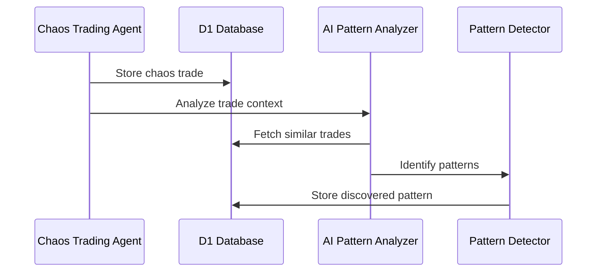

# Coinswarm Audit - Action Checklist

**Audit Date:** 2025-12-05
**Overall Health Score:** 82/100 (B+)
**Status:** Production-Ready with improvements

---

## Immediate Actions (This Week) 🔥

### [ ] HIGH-02: Fix Duplicate Migrations
**Priority:** P1 | **Effort:** 1 day | **Impact:** HIGH

**Problem:** Migration numbering conflicts
- `migrations/028-token-specialization.sql`
- `migrations/028-agent-correlation-matrix.sql`
- `migrations/017-add-regime-column.sql` (deprecated)
- `migrations/044-add-regime-column.sql`

**Action:**
```bash
# Rename duplicates to unique numbers
cd cloudflare-agents/migrations
mv 028-agent-correlation-matrix.sql 045-agent-correlation-matrix.sql
# Delete deprecated 017 (superseded by 044)
rm 017-add-regime-column.sql
# Update any references in code
```

**Verification:**
```bash
# Check for duplicate numbers
ls migrations/*.sql | sed 's/.*\/\([0-9]*\)-.*/\1/' | sort | uniq -d
# Should return empty
```

---

### [ ] HIGH-01: Add Critical Unit Tests
**Priority:** P1 | **Effort:** 3-5 days | **Impact:** HIGH

**Current Coverage:** ~15%
**Target:** 80%

**Critical Tests Needed:**
1. Fitness calculation (fitness/alpha-fitness.ts)
2. Pattern matching (pattern-backtester.ts)
3. Agent decision making (reasoning-agent.ts)
4. Circuit breakers (config/circuit-breakers.ts)
5. Metrics calculations (metrics/advanced-metrics.ts)

**Example Test Template:**
```typescript
// tests/unit/fitness.test.ts
import { calculateAlphaFitness } from '../fitness/alpha-fitness';

describe('Alpha Fitness Calculation', () => {
  test('should calculate fitness with standard metrics', () => {
    const metrics = {
      alphaCagr: 20,
      drawdownAlpha: 5,
      sortinoRatio: 1.5,
      calmarRatio: 2.0,
      winRate: 60,
      maxDrawdownPct: 10
    };
    const fitness = calculateAlphaFitness(metrics);
    expect(fitness).toBeGreaterThan(0);
    expect(fitness).toBeLessThan(100);
  });

  test('should penalize high drawdown', () => {
    // Test with high drawdown
    // Expected: lower fitness score
  });
});
```

**Run Tests:**
```bash
cd cloudflare-agents
npm test
```

---

### [ ] MED-06: Consolidate Schema Documentation
**Priority:** P1 | **Effort:** 3 days | **Impact:** MEDIUM

**Problem:** 14 separate schema files, no single source of truth

**Action:**
1. Create `docs/DATABASE_SCHEMA.md`
2. Document all tables with:
   - Table name
   - Purpose
   - Columns (name, type, description)
   - Indexes
   - Foreign keys
   - Migration history

**Template:**
```markdown
# Database Schema Reference

## Main Evolution DB (coinswarm-evolution)

### Table: chaos_trades
**Purpose:** Stores all chaos trading results for pattern discovery

| Column | Type | Description | Indexed |
|--------|------|-------------|---------|
| trade_id | TEXT PRIMARY KEY | Unique trade identifier | ✓ |
| pair | TEXT | Trading pair (e.g., BTC-USD) | ✓ |
| entry_time | TEXT | ISO timestamp of entry | ✓ |
| exit_time | TEXT | ISO timestamp of exit | |
| pnl_pct | REAL | P&L percentage | |
| profitable | INTEGER | 1 if profitable, 0 if not | ✓ |

**Migrations:**
- 002-reset-chaos-trades.sql
- ...

### Table: discovered_patterns
...
```

---

## Short-Term Actions (This Month) 📅

### [ ] MED-01: Replace Console Logging
**Priority:** P2 | **Effort:** 1 week | **Impact:** MEDIUM

**Files to Update:** 20 files with 159 console.* statements

**Migration Script:**
```bash
# Find all console statements
grep -r "console\." cloudflare-agents/*.ts

# Replace pattern:
# Before: console.log('Message', data);
# After:  logger.info('Message', data);

# Before: console.error('Error', error);
# After:  logger.error('Error', error);
```

**Import to Add:**
```typescript
import { createLogger, LogLevel } from './structured-logger';
const logger = createLogger('ModuleName', LogLevel.INFO);
```

---

### [ ] MED-02: Add Health Check Endpoints
**Priority:** P2 | **Effort:** 1 week | **Impact:** MEDIUM

**Workers Needing Health Checks:**
- historical-data-worker.ts
- multi-exchange-data-worker.ts
- realtime-price-collection-cron.ts
- solana-dex-worker.ts
- sentiment-backfill-worker.ts

**Health Check Template:**
```typescript
// Add to each worker
if (url.pathname === '/health') {
  const health = {
    status: 'ok',
    worker: 'historical-data-worker',
    timestamp: new Date().toISOString(),
    checks: {
      database: await checkDatabase(),
      lastCollection: await checkLastCollectionTime(),
      dataFreshness: await checkDataFreshness()
    }
  };

  const status = health.checks.database &&
                 health.checks.lastCollection < 3600 ? 200 : 503;

  return jsonResponse(health, status);
}
```

---

### [ ] MED-08: Set Up CI/CD Pipeline
**Priority:** P2 | **Effort:** 1 week | **Impact:** MEDIUM

**GitHub Actions Workflow:**

Create `.github/workflows/test.yml`:
```yaml
name: Test Suite

on:
  push:
    branches: [ main, develop ]
  pull_request:
    branches: [ main, develop ]

jobs:
  test:
    runs-on: ubuntu-latest

    steps:
    - uses: actions/checkout@v3

    - name: Setup Node.js
      uses: actions/setup-node@v3
      with:
        node-version: '18'

    - name: Install dependencies
      run: |
        cd cloudflare-agents
        npm ci

    - name: Run tests
      run: |
        cd cloudflare-agents
        npm test

    - name: Run linter
      run: |
        cd cloudflare-agents
        npm run lint

    - name: Check TypeScript
      run: |
        cd cloudflare-agents
        npx tsc --noEmit
```

---

### [ ] MED-03: Complete API Documentation
**Priority:** P2 | **Effort:** 3 days | **Impact:** MEDIUM

**Update `docs/API_REFERENCE.md` with:**

```markdown
## Evolution Agent Endpoints

### GET /status
Returns current evolution agent state

**Response:**
```json
{
  "status": "running",
  "totalCycles": 1234,
  "totalTrades": 56789,
  "patternsDiscovered": 123,
  "lastCycleAt": "2025-12-05T10:30:00Z"
}
```

### POST /chaos-trade (Protected)
Trigger chaos trading cycle

**Headers:**
- Authorization: Bearer {AUTH_TOKEN}

**Response:**
...
```

---

## Medium-Term Actions (This Quarter) 📆

### [ ] MED-05: Resolve TODO Comments
**Priority:** P3 | **Effort:** Ongoing | **Impact:** LOW

**Action:**
```bash
# Generate list of TODOs
grep -rn "TODO\|FIXME\|HACK" cloudflare-agents/*.ts > .state/audit/todos.txt

# Create GitHub issues for each
# Tag with: technical-debt, enhancement, bug (as appropriate)
```

**Example Issue Template:**
```markdown
## TODO: Integrate pattern retirement system

**File:** alpha-decay-detector.ts:426
**Context:**
```typescript
// TODO: Integrate with pattern retirement system
```

**Description:**
Currently decay detection exists but needs integration with pattern retirement workflow.

**Acceptance Criteria:**
- [ ] Auto-retire patterns at 90 days decaying
- [ ] Update pattern status to 'retired'
- [ ] Remove from active competition
- [ ] Preserve for historical analysis

**Labels:** technical-debt, enhancement
```

---

### [ ] MED-07: Add Performance Monitoring
**Priority:** P3 | **Effort:** 1 week | **Impact:** LOW

**Metrics to Track:**
1. CPU time per worker invocation
2. Memory usage in Durable Objects
3. D1 query times
4. API response times

**Implementation:**
```typescript
// Add to each worker
const startTime = Date.now();
const startCpu = process.cpuUsage(); // If available

// ... worker logic ...

const duration = Date.now() - startTime;
const cpuUsage = process.cpuUsage(startCpu); // If available

// Log to structured logger
logger.info('Worker performance', {
  worker: 'evolution-agent',
  duration_ms: duration,
  cpu_user_ms: cpuUsage?.user / 1000,
  cpu_system_ms: cpuUsage?.system / 1000
});

// Store in metrics table
await db.prepare(`
  INSERT INTO performance_metrics (worker_name, duration_ms, timestamp)
  VALUES (?, ?, ?)
`).bind('evolution-agent', duration, new Date().toISOString()).run();
```

---

### [ ] LOW-03: Create Sequence Diagrams
**Priority:** P3 | **Effort:** 1 week | **Impact:** LOW

**Key Workflows to Diagram:**

1. **Chaos Trade → Pattern Discovery**


2. **Agent Backtest Flow**
3. **Elite Competition Flow**
4. **Committee Voting Flow**

Add to `docs/ARCHITECTURE.md`

---

### [ ] LOW-08: Create Operational Runbook
**Priority:** P3 | **Effort:** 3 days | **Impact:** LOW

**Create `docs/OPERATIONS.md`:**

```markdown
# Operations Runbook

## Deployment

### Standard Deployment
```bash
cd cloudflare-agents
wrangler deploy --config wrangler.toml
```

### Emergency Rollback
```bash
# Rollback to previous deployment
wrangler rollback coinswarm-evolution-agent
```

## Common Tasks

### Check Evolution Agent Status
```bash
curl https://evolution.yourdomain.com/status
```

### Trigger Manual Cycle
```bash
curl -X POST https://evolution.yourdomain.com/chaos-trade \
  -H "Authorization: Bearer $AUTH_TOKEN"
```

### Query Pattern Leaderboard
```sql
-- Top 20 patterns by fitness
SELECT pattern_id, name, fitness_score, net_beats, number_of_runs
FROM discovered_patterns
ORDER BY fitness_score DESC
LIMIT 20;
```

## Troubleshooting

### Worker Not Responding
1. Check Cloudflare dashboard for errors
2. Check logs: `wrangler tail coinswarm-evolution-agent`
3. Verify D1 database connectivity
4. Check circuit breaker status

### Data Not Collecting
...
```

---

## Low Priority Actions (As Time Permits) 🕐

### [ ] LOW-01: Replace 'any' Types
**Effort:** 1 week

Find and replace 'any' types with proper definitions
```bash
grep -rn ": any" cloudflare-agents/*.ts
```

---

### [ ] LOW-04: Add Query Caching
**Effort:** 1 week

Add KV caching for expensive queries (leaderboards)

---

### [ ] LOW-13: Verify Index Usage
**Effort:** 3 days

Run EXPLAIN QUERY PLAN on critical queries
```sql
EXPLAIN QUERY PLAN
SELECT * FROM discovered_patterns
WHERE fitness_score > 50
ORDER BY fitness_score DESC
LIMIT 20;
```

---

## Progress Tracking

**Completed:** 0/25
**In Progress:** 0/25
**Not Started:** 25/25

**Last Updated:** 2025-12-05

---

## Notes

- Prioritize HIGH and MED issues before major deployment
- LOW priority issues can be tackled incrementally
- Track progress in GitHub Projects or Jira
- Re-run audit quarterly to measure improvement

---

**Next Audit:** 2026-03-05 (3 months)
